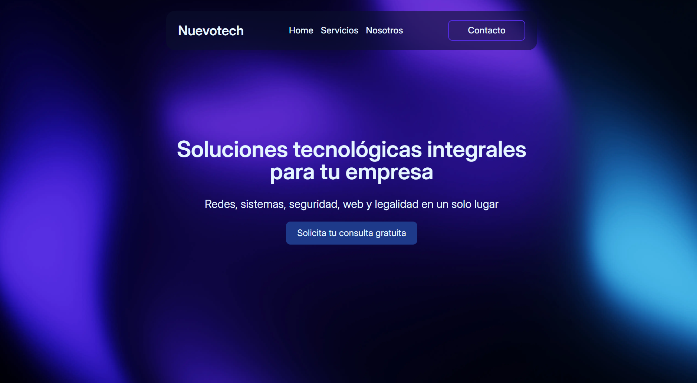

# 🚀 Nuevotech

[](https://nuevotech-sigma.vercel.app)

Web corporativa para **Nuevotech**, una empresa ficticia dedicada a la instalación de redes, configuraciones de sistemas, páginas web, seguridad y legalidad empresarial.




---

## 📚 Descripción

Este proyecto ha sido desarrollado como trabajo final para el instituto, utilizando **React** y estructurado para ser fácilmente comprensible por personas sin conocimientos técnicos.

Incluye:
- Diseño responsive
- Navegación con React Router
- Páginas informativas simuladas
- Estilo profesional y moderno

---

## 🛠️ Tecnologías usadas

- React
- React Router DOM
- Vite
- Tailwind CSS

---

## 🚀 Cómo ejecutarlo localmente

1. Clona el repositorio:
   
   ```bash
   git clone https://github.com/PauProg/nuevotech.git
   cd nuevotech

2. Instala las dependencias:
   
   ```bash
   npm install

3. Ejecuta el servidor de desarrollo:
   
   ```bash
   npm run dev

---

## 📁 Estructura básica del proyecto


src/
├── assets/ ├── components/ ├── pages/ ├── App.jsx ├── main.jsx

- `assets/`: Imagenes y recursos.
- `components/`: Componentes reutilizables.
- `pages/`: Vistas principales.
- `App.jsx`: Componente raíz.
- `main.jsx`: Punto de entrada.

---

## 👤 Autor

Desarrollado por [PauProg](https://www.github.com/pauprog)
